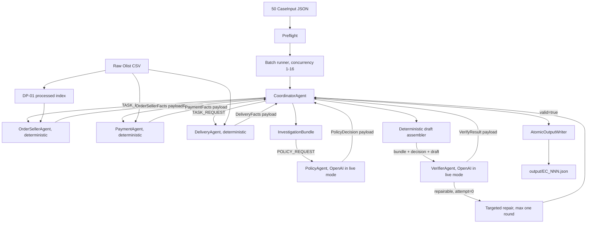

# Multi-Agent Architecture — E-commerce Dispute Resolution

## 1. Phạm vi kiến trúc thực tế

Hệ thống xử lý 50 khiếu nại Olist bằng sáu **logical runtime unit** được đăng ký trong `AgentRuntime`:

1. `CoordinatorAgent`: điều phối flow và quản lý state; không đọc CSV và không chứa policy rule.
2. `OrderSellerAgent`: đọc order/item/seller và tổng hợp `OrderSellerFacts` bằng deterministic tools.
3. `PaymentAgent`: đọc payment rows, tính tổng và reconciliation bằng deterministic tools.
4. `DeliveryAgent`: so sánh timestamp và phân loại seller/logistics bằng deterministic tools.
5. `PolicyAgent`: áp dụng `EC_POLICY_V1`, sau đó đối chiếu structured model output với kết quả deterministic authoritative.
6. `VerifierAgent`: recompute policy, kiểm draft và đối chiếu structured model output với kết quả deterministic authoritative.

Trong `--live` mode, chỉ `PolicyAgent` và `VerifierAgent` tạo hai OpenAI model client/context độc lập. Coordinator và ba domain agent là logical agent chạy bằng Python/tool có prompt, allowlist và Pydantic output contract nhưng **không gọi model**. Trong `--hybrid` mode, Policy/Verifier dùng offline authoritative echo invoker để kiểm tra integration mà không gọi API.

Model cấu hình hiện tại là `o4-mini`. `src/config/agents.yaml` khai báo sáu logical agent và upper bound `10,000,000,000` parameters theo nguồn `user_attested`; đây là metadata/config guard của nhóm, không phải parameter count chính thức do provider công bố.

## 2. Thành phần và data flow



### Preflight và DP-01

- `src.preflight.run_preflight` kiểm đúng 50 case `EC_001`–`EC_050`, case ID trùng/thiếu và order ID có tồn tại trong orders CSV.
- `scripts/preprocess_data.py` là task offline tạo `data/processed/olist_case_index.sqlite` và manifest read-only.
- Live runner không tự chạy lại preprocessing; nó sử dụng raw CSV và processed artifact đang có trong workspace.
- `OrderSellerAgent` dùng repository adapter; Payment và Delivery hiện gọi deterministic CSV tools theo domain của mình.

## 3. Chế độ chạy

| Mode | Domain handlers | Policy/Verifier | Ghi output |
| --- | --- | --- | --- |
| `--stub` | Contract-safe stubs | Stubs | Không hỗ trợ |
| `--hybrid` | OrderSeller, Payment, Delivery thật | Offline authoritative echo | Có khi dùng `--write-output` |
| `--live` | OrderSeller, Payment, Delivery thật | Hai OpenAI structured-output clients độc lập | Có khi dùng `--write-output` |

Lệnh live batch chính:

```powershell
.\.venv\Scripts\python.exe -m src.runner --batch --live --write-output --concurrency 2
```

Batch runner dùng `asyncio.Semaphore`; concurrency hợp lệ từ 1 đến 16. Một case lỗi được cô lập, ghi terminal failure và không dừng các case còn lại.

## 4. Quyền truy cập thực tế

| Logical unit | Read access | Allowed operations | Model call | Write access |
| --- | --- | --- | --- | --- |
| Coordinator | Case và validated payload trong state | Invoke handler, fan-in, route repair | Không | Emit trace; gọi writer sau verify |
| OrderSeller | Order, item, seller repository | Lookup và deterministic aggregation | Không | Không |
| Payment | Payment và order financial reference | Lookup, Decimal sum, reconciliation | Không | Không |
| Delivery | Delivery timestamps và shipping limits | Lookup và timestamp comparison | Không | Không |
| Policy | `InvestigationBundle`, policy definition | Policy evaluator và draft assembly interface | Có trong live mode | Không ghi output |
| Verifier | Bundle, decision và draft | Policy/schema/evidence-format/financial checks | Có trong live mode | Không |
| Atomic writer | Draft đã verify | JSON Schema validation, temp file và `os.replace` | Không | Chỉ `output/` |

Verifier hiện kiểm định dạng evidence và tính nhất quán policy/financial. `verify_output` có hỗ trợ callback `evidence_lookup`, nhưng live `VerifierAgent` chưa inject callback này; vì vậy kiểm tra evidence tồn tại trong raw data hiện được thực hiện bằng auditor độc lập `scripts/audit_outputs.py`, không phải trong live verification path.

## 5. Contract và handoff

### Request contract

Mọi request do Coordinator gửi qua runtime dùng `HandoffEnvelope`:

```text
schema_version, run_id, case_id, correlation_id,
sender, receiver, message_type, attempt, payload, evidence_ids
```

Các request đang được sử dụng:

- `TASK_REQUEST` tới ba domain agent.
- `POLICY_REQUEST` tới PolicyAgent.
- `VERIFY_REQUEST` tới VerifierAgent.

### Response contract

Handler trả trực tiếp dictionary đã/được validate thành Pydantic model tương ứng:

- `OrderSellerFacts`
- `PaymentFacts`
- `DeliveryFacts`
- `PolicyDecision`
- `VerifyResult`

Các response hiện **không được bọc lại trong `HandoffEnvelope`**. Các enum `FACT_RESPONSE`, `DECISION_RESPONSE`, `VERIFY_RESULT` và `REPAIR_REQUEST` có trong shared contract để mở rộng, nhưng runtime hiện chưa dùng chúng làm response envelope.

## 6. Policy, draft và verification

### Policy

`PolicyAgent` nhận immutable bundle và gọi deterministic `evaluate_ec_policy_v1`. OpenAI structured output phải bằng authoritative `PolicyDecision`; nếu khác, invocation fail thay vì chấp nhận model hallucination.

### Draft assembly

`assemble_tv5_draft` gọi deterministic `assemble_output` để:

- kiểm facts của ba domain cùng order ID;
- tạo affected entities ổn định và giới hạn theo schema;
- tổng hợp policy/domain evidence tối đa 10 ID;
- chuẩn hóa item, freight, payment và refund về hai chữ số;
- tạo final draft mà không ghi filesystem.

### Verification

Verifier thực hiện hai deterministic checks:

1. Recompute `PolicyDecision` từ bundle và so từng field.
2. Kiểm cấu trúc draft, enum/list limits, evidence format, issue/cause/party/action mapping và financial/refund consistency.

OpenAI `VerifierAgent` phải trả đúng authoritative `VerifyResult`. Chỉ `valid=true` mới cho phép writer ghi file.

## 7. Retry và targeted repair

Runtime retry tối đa một lần cho lỗi tạm thời thuộc `TimeoutError`, `ConnectionError` hoặc `OSError`. Contract/model disagreement không được retry như lỗi mạng.

Nếu Verifier trả lỗi repairable ở attempt 0:

1. Coordinator đọc `errors[*].repair_target`.
2. Với domain target, Coordinator gửi lại `TASK_REQUEST` có thêm `repair_errors`, `attempt=1` chỉ tới domain cần sửa.
3. Với policy target, ba domain agent không chạy lại.
4. Coordinator rebuild bundle khi domain facts thay đổi.
5. Policy, draft assembly và Verifier luôn chạy lại với `attempt=1`.
6. Không có vòng repair thứ hai.

Implementation hiện không gửi message type `REPAIR_REQUEST`; repair domain dùng `TASK_REQUEST` kèm `repair_errors`.

## 8. Atomic output

`AtomicOutputWriter` chỉ ghi khi:

- `VerifyResult.valid=true`;
- `case_id` trong draft khớp case yêu cầu;
- draft pass JSON Schema 2020-12.

Writer ghi vào temporary file trong cùng thư mục, flush + `fsync`, sau đó dùng `os.replace`. Batch được xem là thành công khi đạt:

```text
50 received = 50 verified = 50 written = 50 terminal
```

## 9. Trace, metadata và run summary hiện tại

Implementation hiện lưu artifact của **lần chạy gần nhất**, không có immutable per-run history:

| Artifact | Nội dung |
| --- | --- |
| `trace.jsonl` | Trace latest invocation; `TraceSink(reset=True)` thay nguyên file khi bắt đầu run |
| `metadata.json` | Snapshot config sáu logical agent và run ID |
| `logging/run_summary.json` | Batch counters, results, errors và primary issue counts |

`TraceEvent` hiện có run/case/correlation ID, agent, sender/receiver, attempt, duration, status, evidence IDs, output summary và error. Model name, parameter metadata và prompt version **không nằm trên từng trace event**; chúng nằm trong `metadata.json`.

Hệ thống hiện chưa tạo `logging/runs/<run_id>/`, chưa có bước promote run và chưa emit response envelope riêng. `scripts/summarize_run.py`/`compare_runs.py` là reporting skeleton cho cấu trúc run history tương lai, không phải storage path mà runner hiện đang tạo.

### Quy tắc vận hành artifact nộp bài

`trace.jsonl`, `metadata.json`, `logging/run_summary.json` và 50 output phải có cùng run ID/ngữ cảnh. Một số test/integration command có thể khởi tạo `TraceSink` ở root và làm thay trace mới nhất. Vì vậy quy trình an toàn là:

1. Chạy toàn bộ test trước.
2. Chạy live batch cuối cùng.
3. Kiểm run ID giữa trace, metadata và summary.
4. Không chạy lệnh có thể ghi root trace sau lần live cuối.

Lệnh kiểm run ID:

```powershell
.\.venv\Scripts\python.exe -c "import json; from pathlib import Path; m=json.loads(Path('metadata.json').read_text()); s=json.loads(Path('logging/run_summary.json').read_text()); t={json.loads(x)['run_id'] for x in Path('trace.jsonl').read_text().splitlines() if x.strip()}; print(m['run_id'], s['run_id'], t)"
```

## 10. Giới hạn đã biết

- Chỉ PolicyAgent và VerifierAgent là model-backed trong live mode.
- Response là structured payload, chưa phải response `HandoffEnvelope`.
- Evidence existence lookup chưa được inject vào live Verifier.
- Không có immutable per-run history/promotion.
- Trace event không lặp lại model/parameter/prompt metadata.
- Parameter limit của `o4-mini` đang dựa trên `user_attested` upper bound trong config.

Các giới hạn trên được ghi rõ để tài liệu phản ánh đúng code đang chạy, không mô tả capability chưa được triển khai.
