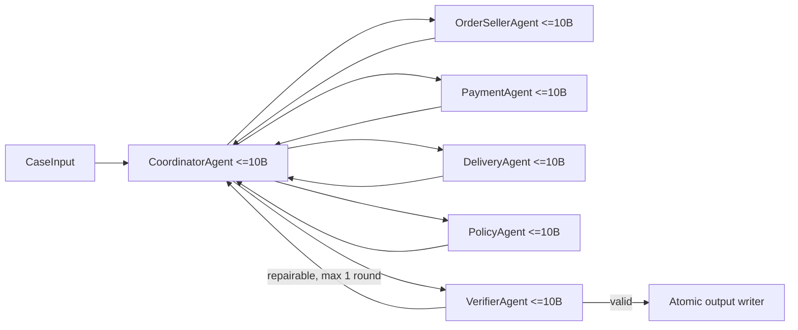

# Multi-Agent Architecture — E-commerce Dispute Resolution

## Architecture summary

Hệ thống gồm 6 logical agent độc lập, mỗi agent có model `<=10B`, system prompt, context, tool allowlist và structured output schema riêng:

1. `CoordinatorAgent`: điều phối và route handoff, không đọc CSV hoặc tự quyết nghiệp vụ.
2. `OrderSellerAgent`: điều tra order, item, seller và shipping limit.
3. `PaymentAgent`: điều tra payment và financial reconciliation.
4. `DeliveryAgent`: xác định giao trễ và seller/logistics handoff.
5. `PolicyAgent`: áp dụng `EC_POLICY_V1` theo đúng thứ tự ưu tiên.
6. `VerifierAgent`: kiểm độc lập schema, evidence, financial resolution và policy trước khi ghi output.

Thiết kế, schema, sequence, state machine, repair flow và trace contract đầy đủ nằm tại [docs/multi-agent-flow.md](docs/multi-agent-flow.md).

Trước agent runtime, task deterministic `DP-01` validate raw CSV, chuẩn hóa kiểu dữ liệu, lọc/index các row thuộc 50 order và tạo processed case index read-only. DP-01 không đưa ra kết luận nghiệp vụ; các domain agent vẫn chịu trách nhiệm điều tra và handoff. Chi tiết task và checkpoint nằm trong [docs/team-plan.md](docs/team-plan.md).

## Agent permissions

| Agent | Read access | Tools | Write access |
| --- | --- | --- | --- |
| Coordinator | Case và structured handoff | invoke agent, validate contract | Trace event qua runtime |
| OrderSeller | Orders, items, sellers | lookup và deterministic aggregation | Không |
| Payment | Payments và totals cần đối soát | lookup, Decimal sum/reconcile | Không |
| Delivery | Order delivery timestamps, item shipping limits | lookup, timestamp comparison | Không |
| Policy | Investigation bundle, policy definition | priority evaluator, refund calculator | Không |
| Verifier | Draft và read-only evidence lookup | schema/evidence/finance/policy checks | Không |

Chỉ runtime writer được ghi `output/`, và chỉ sau `VERIFY_RESULT.valid=true`.

## Handoff flow

Mọi A2A message dùng envelope gồm `run_id`, `case_id`, `correlation_id`, `sender`, `receiver`, `message_type`, `attempt`, `payload` và `evidence_ids`.

1. Coordinator fan-out ba `TASK_REQUEST` độc lập tới OrderSeller, Payment và Delivery.
2. Ba domain agent gọi tool read-only và trả `FACT_RESPONSE` có schema.
3. Coordinator fan-in, validate và đóng băng `InvestigationBundle`.
4. Policy nhận `POLICY_REQUEST`, trả `DECISION_RESPONSE`.
5. Verifier nhận `VERIFY_REQUEST`, kiểm độc lập và trả `VERIFY_RESULT`.
6. Nếu hợp lệ, runtime atomic-write `output/<case_id>.json`.
7. Nếu repairable, Coordinator gửi lỗi về đúng agent, tối đa một vòng, rồi chạy lại Policy và Verifier.
8. Nếu vẫn sai hoặc non-repairable, case fail và không sinh output giả.

## Model constraint

Startup guard kiểm `model_name`, `parameter_count`, prompt version, allowed tools và fallback của từng agent. Run dừng trước khi đọc case nếu bất kỳ model/fallback nào vượt `10,000,000,000` parameters hoặc thiếu parameter metadata. `metadata.json` ghi cấu hình riêng cho cả 6 agent.

## Audit and verification

Mỗi run có thư mục bất biến `logging/runs/<run_id>/` chứa trace, case summary, errors, verifier feedback, metrics và config snapshot để so sánh/cải tiến. Root `trace.jsonl` chỉ là bản sanitized của run được promote và luôn bị thay thế nguyên file để đúng yêu cầu nộp bài. Thiết kế observability đầy đủ nằm tại [docs/observability-and-improvement.md](docs/observability-and-improvement.md).

Trace phải chứng minh invocation và handoff thật: sender/receiver, model, parameter count, prompt version, tool calls, evidence IDs, attempt, duration và verify result. Một case thành công phải có invocation độc lập của Coordinator, ba domain agent, Policy và Verifier; một model call duy nhất không được xem là multi-agent.
