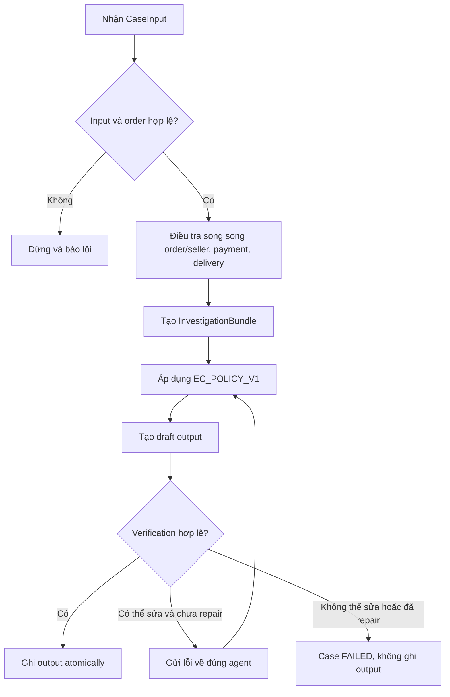

# Tài liệu nghiệp vụ tối thiểu — Xử lý khiếu nại thương mại điện tử

## 1. Thông tin tài liệu

| Thuộc tính | Giá trị |
| --- | --- |
| Dự án | K3 Day 09 — Multi-Agent E-commerce Dispute Resolution |
| Tên tài liệu | Tài liệu nghiệp vụ tối thiểu |
| Phiên bản | 1.0 |
| Trạng thái | Working baseline |
| Policy áp dụng | `EC_POLICY_V1` |
| Nguồn yêu cầu | `README.md`, source code policy, schema và test hiện có |

### Lịch sử thay đổi

| Phiên bản | Ngày | Nội dung |
| --- | --- | --- |
| 1.0 | 2026-08-05 | Tạo baseline nghiệp vụ tối thiểu để BA, dev và tester cùng làm việc |

## 2. Mục tiêu nghiệp vụ

Hệ thống điều tra 50 yêu cầu hỗ trợ của khách hàng dựa trên dữ liệu Olist, xác định vấn đề chính, nguyên nhân, bên chịu trách nhiệm, bằng chứng, khoản hoàn tiền đề xuất và hành động xử lý.

Kết luận phải dựa trên dữ liệu có thể kiểm chứng. Nội dung khách hàng cung cấp là đầu vào để xác định case và order cần điều tra, không phải bằng chứng đủ để tự động chấp nhận khiếu nại.

### Tiêu chí thành công

- Mỗi input hợp lệ tạo ra đúng một kết luận nghiệp vụ có cấu trúc.
- Kết luận tuân thủ đúng thứ tự ưu tiên của `EC_POLICY_V1`.
- Mọi số tiền được tính từ dữ liệu nguồn và làm tròn hai chữ số thập phân.
- Mọi evidence ID trong output có định dạng hợp lệ và truy ngược được về dữ liệu hoặc policy.
- Chỉ phát hành output khi kết quả vượt qua bước verification.

## 3. Phạm vi

### Trong phạm vi

- Xử lý đúng 50 case từ `EC_001` đến `EC_050`.
- Điều tra order, item, seller, payment và các mốc giao hàng liên quan đến `claimed_order_id`.
- Phân loại một trong sáu vấn đề được `EC_POLICY_V1` hỗ trợ.
- Xác định bên chịu trách nhiệm, khoản hoàn đề xuất và hành động xử lý.
- Tạo và kiểm chứng output JSON theo schema quy định.
- Ghi trace phục vụ kiểm toán luồng multi-agent.

### Ngoài phạm vi

- Thực hiện giao dịch hoàn tiền thật.
- Gửi email hoặc thông báo thật cho khách hàng, seller hay đơn vị vận chuyển.
- Suy diễn transaction ID, refund ledger, tracking checkpoint theo item hoặc bằng chứng giao sai/giao thiếu vì dataset không cung cấp.
- Xử lý các loại khiếu nại ngoài sáu nhánh của `EC_POLICY_V1`.
- Quy đổi tiền tệ hoặc điều chỉnh múi giờ của timestamp trong CSV.
- Thiết kế giao diện người dùng.

## 4. Thuật ngữ

| Thuật ngữ | Ý nghĩa |
| --- | --- |
| Case | Một yêu cầu hỗ trợ, có mã `EC_NNN` |
| Claimed order | Order khách hàng khai báo trong input |
| Shipping limit | Hạn seller phải bàn giao hàng cho carrier, lấy từ `shipping_limit_date` của item |
| Estimated delivery | Hạn dự kiến giao tới khách, lấy từ `order_estimated_delivery_date` |
| Carrier handoff | Thời điểm carrier nhận hàng, lấy từ `order_delivered_carrier_date` |
| Actual delivery | Thời điểm khách nhận hàng, lấy từ `order_delivered_customer_date` |
| Split payment | Một order có từ hai payment row trở lên |
| Reconciled payment | Tổng payment khớp tổng item và freight trong sai số cho phép |
| Evidence ID | Định danh bằng chứng có thể truy ngược về dữ liệu nguồn hoặc policy |
| BRL | Đồng Real Brazil |

## 5. Tác nhân và trách nhiệm

| Tác nhân/thành phần | Trách nhiệm nghiệp vụ |
| --- | --- |
| Khách hàng | Cung cấp nội dung yêu cầu và `claimed_order_id` |
| Coordinator | Điều phối điều tra, tổng hợp kết quả có cấu trúc; không tự quyết định nghiệp vụ |
| Order & Seller Agent | Xác minh trạng thái order, item, seller, shipping limit và tổng item/freight |
| Payment Agent | Tổng hợp payment rows và đối soát với tổng item + freight |
| Delivery Agent | Xác định có giao trễ không và lỗi thuộc seller hay logistics |
| Policy Agent | Áp dụng `EC_POLICY_V1` theo đúng thứ tự ưu tiên |
| Verifier Agent | Kiểm tra độc lập schema, evidence, tài chính và policy |
| Runtime writer | Chỉ ghi output sau khi Verifier xác nhận hợp lệ |

## 6. Luồng nghiệp vụ mục tiêu



### Quy tắc điều phối

1. Ba domain investigation phải dùng cùng `claimed_order_id`.
2. Kết quả của mỗi agent phải được validate theo contract trước khi tổng hợp.
3. Policy chỉ nhận `InvestigationBundle`, không tự đọc CSV.
4. Verifier phải độc lập với Policy Agent và không tự sửa quyết định.
5. Chỉ cho phép tối đa một vòng repair đối với lỗi repairable.
6. Không được tạo output giả khi case không khớp rule hoặc verification thất bại.

## 7. Quy tắc dữ liệu và tính toán

### 7.1 Khóa liên kết chính

| Từ bảng/cột | Đến bảng/cột | Mục đích |
| --- | --- | --- |
| `orders.order_id` | `order_items.order_id` | Lấy item, seller, giá và freight |
| `orders.order_id` | `order_payments.order_id` | Lấy các payment row |
| `order_items.seller_id` | `sellers.seller_id` | Xác minh seller |
| `order_items.product_id` | `products.product_id` | Tra cứu sản phẩm khi cần |

### 7.2 Công thức tài chính

```text
item_total_brl = SUM(order_items.price)
freight_total_brl = SUM(order_items.freight_value)
reference_order_total_brl = item_total_brl + freight_total_brl
payment_total_brl = SUM(order_payments.payment_value)
reconciliation_delta_brl = ABS(payment_total_brl - reference_order_total_brl)
is_reconciled = reconciliation_delta_brl <= 0.10 BRL
```

Quy tắc bổ sung:

- Mọi giá trị tiền phải hữu hạn, không âm và được làm tròn hai chữ số thập phân.
- `payment_value` là giá trị của từng payment row, không phải giá trị của từng installment.
- Nếu order không có item, `item_total_brl` và `freight_total_brl` bằng `0.00`; danh sách item và seller để rỗng.

### 7.3 Quy tắc giao hàng

- `is_late = true` khi `actual delivery > estimated delivery`.
- Nếu không giao trễ, kết quả delivery là `not_late`.
- Nếu giao trễ và `carrier handoff > shipping_limit_date` của ít nhất một item, lỗi thuộc seller của item vi phạm.
- Nếu giao trễ nhưng không có seller nào bàn giao sau hạn, lỗi thuộc logistics provider.
- Nếu thiếu timestamp cần thiết, kết quả là `undetermined`; hệ thống không được tự tạo giá trị thay thế.
- So sánh timestamp theo đúng giá trị trong CSV, không chuyển múi giờ.

## 8. Bảng quyết định `EC_POLICY_V1`

Các rule phải được xét từ trên xuống. Khi một rule khớp, dừng và không xét rule thấp hơn.

| Ưu tiên | Điều kiện | Primary issue | Root cause | Bên chịu trách nhiệm | Refund | Action | Case status |
| ---: | --- | --- | --- | --- | ---: | --- | --- |
| 1 | `order_status = canceled` và `payment_total > 0` | `canceled_order_paid` | `ORDER_CANCELED_AFTER_PAYMENT` | Platform / `OLIST_PLATFORM` | Toàn bộ payment | `issue_full_refund` | `action_required` |
| 2 | `order_status = unavailable` và `payment_total > 0` | `unavailable_order_paid` | `ORDER_UNAVAILABLE_AFTER_PAYMENT` | Platform / `OLIST_PLATFORM` | Toàn bộ payment | `issue_full_refund` | `action_required` |
| 3 | Giao trễ và có seller bàn giao sau shipping limit | `late_delivery_seller` | `SELLER_HANDOFF_AFTER_LIMIT` | Seller vi phạm | Toàn bộ freight | `refund_freight` | `action_required` nếu freight > 0 |
| 4 | Giao trễ và không có seller bàn giao sau shipping limit | `late_delivery_logistics` | `CARRIER_DELIVERED_AFTER_ESTIMATE` | Logistics / `LOGISTICS_PROVIDER` | Toàn bộ freight | `refund_freight` | `action_required` nếu freight > 0 |
| 5 | Có từ 2 payment row và payment được đối soát | `valid_split_payment` | `MULTIPLE_PAYMENTS_RECONCILED` | Không có | `0.00` | `explain_valid_split_payment` | `no_action` |
| 6 | Không giao trễ và payment được đối soát | `unsupported_late_claim` | `DELIVERY_WITHIN_ESTIMATE` | Không có | `0.00` | `reject_late_refund` | `no_action` |

Nếu bundle không khớp bất kỳ rule nào, trả lỗi `POLICY_UNRESOLVED`; không tự chọn issue gần giống nhất.

## 9. Evidence

### Định dạng được phép

```text
order:<order_id>
item:<order_id>:<order_item_id>
payment:<order_id>:<payment_sequential>
seller:<seller_id>
policy:<root_cause_code>
```

### Quy tắc

- Evidence dữ liệu phải tồn tại trong nguồn dữ liệu tương ứng.
- Policy evidence phải khớp root cause được chọn.
- Evidence không được trùng lặp.
- Output có tối đa 10 evidence ID.
- Không tạo evidence cho tracking, refund hoặc transaction không tồn tại trong dataset.

## 10. Yêu cầu chức năng tối thiểu

| ID | Yêu cầu | Ưu tiên | Tiêu chí hoàn thành |
| --- | --- | --- | --- |
| BR-01 | Validate bộ input | High | Có đúng 50 case; không thiếu, thừa, trùng; mọi claimed order tồn tại |
| BR-02 | Điều tra order và seller | High | Trả đúng order status, item, seller, shipping limit, item total và freight total |
| BR-03 | Điều tra payment | High | Trả đủ payment rows, tổng payment, số row, delta và trạng thái reconciliation |
| BR-04 | Điều tra delivery | High | Xác định đúng on-time, seller-late, logistics-late hoặc undetermined |
| BR-05 | Áp dụng policy | High | Chọn đúng một trong sáu rule theo thứ tự ưu tiên |
| BR-06 | Tạo output | High | Output đúng schema và giới hạn số phần tử |
| BR-07 | Verification độc lập | High | Kiểm tra schema, evidence, tài chính và policy trước khi ghi file |
| BR-08 | Repair có kiểm soát | Medium | Chỉ repair lỗi được phép, đúng target và tối đa một vòng |
| BR-09 | Ghi output an toàn | High | Chỉ ghi khi valid; tên file khớp case; không để file dở dang |
| BR-10 | Audit trace | High | Mỗi invocation/handoff có run, case, correlation, agent, attempt, duration và trạng thái |

## 11. Yêu cầu output

Mỗi case thành công tạo `output/<case_id>.json` với các nhóm dữ liệu:

- `assessment`
- `affected_entities`
- `root_cause_analysis`
- `evidence_ids`
- `financial_resolution`
- `resolution_actions`

Giới hạn:

| Thành phần | Giới hạn |
| --- | ---: |
| Order IDs | 5 |
| Item IDs | 5 |
| Seller IDs | 5 |
| Payment IDs | 5 |
| Evidence IDs | 10 |
| Ranked causes | 3 |
| Responsible parties | 3 |
| Resolution actions | 5 |

`confidence` phải thuộc `[0, 1]`; currency luôn là `BRL`.

## 12. Acceptance scenarios tối thiểu

| ID | Given | When | Then |
| --- | --- | --- | --- |
| AC-01 | Order canceled, đã thanh toán và đồng thời có dấu hiệu giao trễ | Áp dụng policy | Chọn `canceled_order_paid`, hoàn toàn bộ payment; không chọn rule giao trễ |
| AC-02 | Order unavailable và payment total > 0 | Áp dụng policy | Chọn `unavailable_order_paid`, platform chịu trách nhiệm, hoàn toàn bộ payment |
| AC-03 | Khách nhận sau estimated date và carrier nhận sau shipping limit | Điều tra delivery và áp dụng policy | Chọn `late_delivery_seller`, seller vi phạm chịu trách nhiệm, hoàn freight |
| AC-04 | Khách nhận sau estimated date nhưng carrier nhận không sau shipping limit | Điều tra delivery và áp dụng policy | Chọn `late_delivery_logistics`, logistics chịu trách nhiệm, hoàn freight |
| AC-05 | Order có ít nhất hai payment row, delta bằng `0.10` BRL | Đối soát payment | Payment được coi là reconciled; chọn `valid_split_payment` nếu không có rule ưu tiên cao hơn |
| AC-06 | Order có ít nhất hai payment row, delta bằng `0.11` BRL | Đối soát payment | Payment không được coi là reconciled |
| AC-07 | Khách báo giao trễ nhưng actual delivery không sau estimated delivery và payment khớp | Áp dụng policy | Chọn `unsupported_late_claim`, refund bằng `0.00` |
| AC-08 | Thiếu timestamp cần thiết và không khớp rule khác | Áp dụng policy | Không suy diễn; trả lỗi unresolved thay vì tạo kết luận giả |
| AC-09 | Output chứa evidence ID không tồn tại | Verify output | Verification thất bại và output không được phát hành |
| AC-10 | Refund hoặc responsible party không khớp rule | Verify policy | Verification thất bại và chỉ route repair nếu lỗi được phân loại repairable |

## 13. Ràng buộc sản phẩm và phi chức năng

- Mỗi logical agent sử dụng model không vượt quá 10 tỷ tham số, kể cả fallback hoặc repair.
- Agent chỉ được gọi tool nằm trong allowlist của mình.
- Domain agent chỉ đọc dữ liệu, không ghi vào `output/`.
- Chỉ runtime writer có quyền ghi output sau verification.
- Tính toán tiền phải dùng decimal để tránh sai số floating point.
- Structured output phải được validate; không chấp nhận field thừa.
- Trace không được chứa API key, secret hoặc dữ liệu nhạy cảm không cần thiết.
- Kết quả nên có tính lặp lại; cấu hình mặc định dùng temperature thấp.

## 14. Giả định và nội dung cần xác nhận

| ID | Loại | Nội dung | Trạng thái/đề xuất |
| --- | --- | --- | --- |
| Q-01 | Fact | Bộ chấm chính thức không có trường hợp nhiều seller gây mơ hồ | Theo README; cần giữ assumption nếu dùng dataset khác |
| Q-02 | Assumption | `action_required` phụ thuộc `recommended_refund_brl > 0` | Đang đúng theo implementation policy; cần xác nhận mong muốn khi freight bằng 0 |
| Q-03 | Gap | Flow mục tiêu yêu cầu batch 50 case, draft verification, repair và atomic writer | Kiến trúc đã mô tả nhưng CLI hiện tại chưa nối hoàn chỉnh |
| Q-04 | Gap | Hybrid runtime hiện dùng stub cho Order/Seller và Payment | Cần thay bằng handler thật trước khi coi là production flow |
| Q-05 | Clarification | Cách xử lý business đối với payment mismatch, order processing hoặc timestamp thiếu chưa có rule kết luận | Giữ `POLICY_UNRESOLVED`; không tự bổ sung rule |
| Q-06 | Clarification | Có bắt buộc trả thông điệp giải thích bằng tiếng của input hay chỉ cần JSON chuẩn | Output schema hiện không có trường customer message |

## 15. Traceability

| Vấn đề nghiệp vụ | Yêu cầu liên quan | Kết quả mong muốn |
| --- | --- | --- |
| Claim của khách có thể không chính xác | BR-02, BR-03, BR-04, BR-07 | Kết luận dựa trên evidence thay vì chỉ dựa trên message |
| Một case cần dữ liệu từ nhiều domain | BR-02, BR-03, BR-04 | InvestigationBundle thống nhất theo order ID |
| Rule có thể cùng lúc thỏa nhiều điều kiện | BR-05 | Áp dụng đúng thứ tự ưu tiên 1–6 |
| Sai refund gây ảnh hưởng tài chính | BR-03, BR-05, BR-07 | Refund được tính deterministic và kiểm tra độc lập |
| Evidence giả làm kết luận không thể kiểm toán | BR-07, BR-10 | Evidence tồn tại và trace truy vết được |
| File output dở dang hoặc chưa verify | BR-09 | Chỉ atomic-write sau `valid=true` |

## 16. Điều kiện sẵn sàng cho dev và test

Một thay đổi nghiệp vụ chỉ sẵn sàng triển khai khi:

- Rule, thứ tự ưu tiên, input cần dùng và output mong đợi đã rõ.
- Công thức tài chính và cách làm tròn đã xác định.
- Trường hợp thiếu dữ liệu và lỗi unresolved đã được mô tả.
- Có ít nhất một acceptance scenario cho happy path và boundary/error path.
- Không mâu thuẫn với output schema và evidence convention.
- Nếu thay đổi `EC_POLICY_V1`, policy code, verifier và golden test phải được cập nhật đồng bộ.

