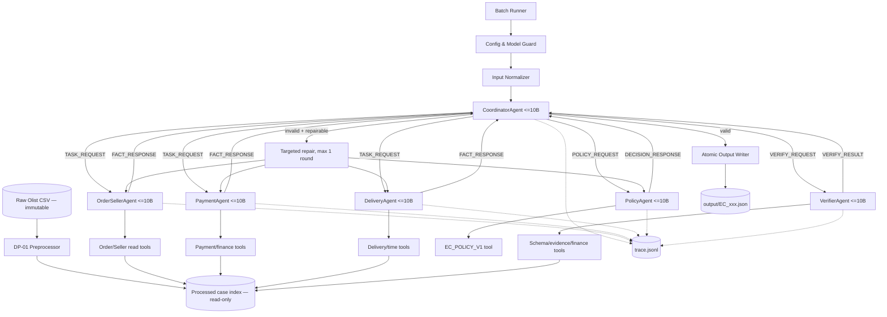
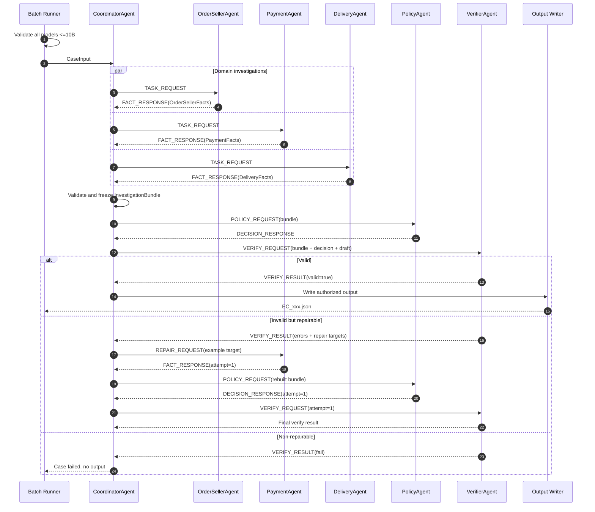
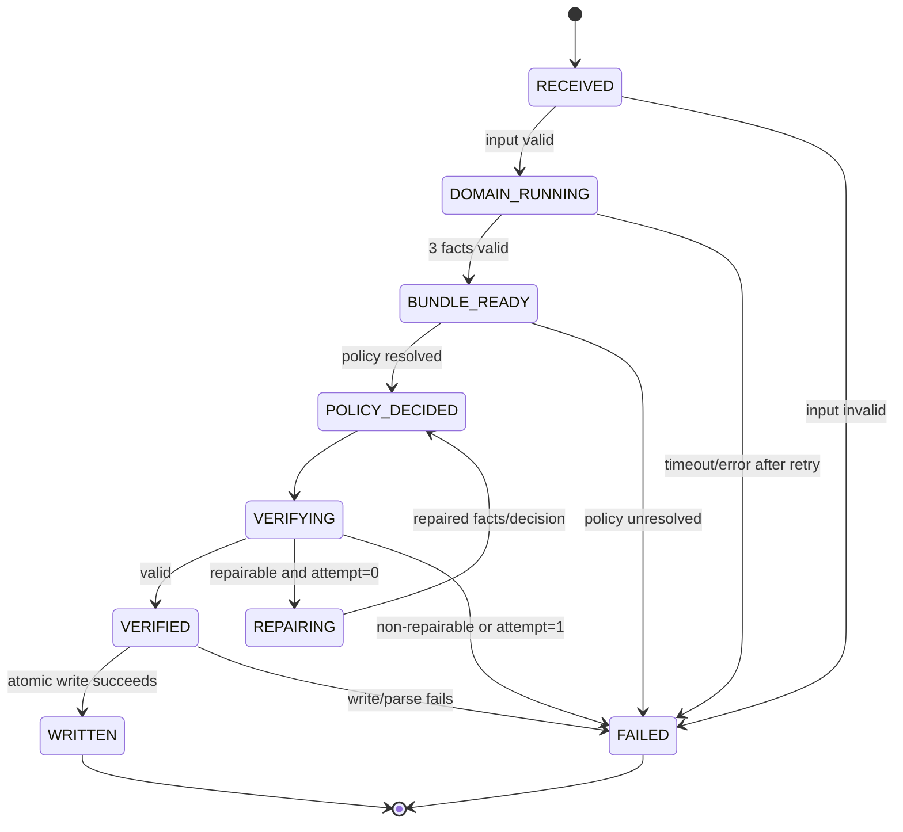

# Thiết kế chi tiết luồng hoạt động Multi-Agent

## 1. Mục tiêu thiết kế

Hệ thống xử lý từng khiếu nại bằng 6 logical agent độc lập:

1. `CoordinatorAgent`
2. `OrderSellerAgent`
3. `PaymentAgent`
4. `DeliveryAgent`
5. `PolicyAgent`
6. `VerifierAgent`

Mỗi agent có model, system prompt, context, quyền gọi tool, input schema và output schema riêng. Model của **mọi agent** phải có parameter count không quá `10,000,000,000`. Không được dùng model lớn hơn 10B cho fallback, judge, repair hoặc bước chạy ẩn.

Python/SQL chỉ cung cấp tool đọc dữ liệu, join, tính toán và validate xác định. Tool không thay thế agent: agent nhận nhiệm vụ, quyết định gọi tool nào trong allowlist, tổng hợp kết quả có cấu trúc và handoff cho agent kế tiếp.

## 2. Kiến trúc tổng thể



`Batch Runner`, model guard, input normalizer, trace sink và output writer là runtime services, không phải agent. Chúng không được đưa ra kết luận nghiệp vụ.

`DP-01 Preprocessor` cũng là deterministic runtime task, không phải agent. Nó validate schema/type, lọc raw rows liên quan 50 order, lập index và tính aggregate cơ sở bằng Decimal. Nó không được phân loại issue, responsible party, refund hoặc action. Chi tiết ownership/checkpoint nằm trong [team-plan.md](team-plan.md).

## 3. Quyền và trách nhiệm của từng agent

| Agent | Nhiệm vụ | Dữ liệu được thấy | Tool được phép | Không được phép |
| --- | --- | --- | --- | --- |
| Coordinator | Điều phối, fan-out/fan-in, kiểm contract, route repair | Case input, response có cấu trúc của agent | Agent invocation, contract validator | Đọc CSV, tự tính tiền, tự quyết policy |
| OrderSeller | Điều tra order, item, seller và shipping limit | `case_id`, `order_id`, policy version | `get_order`, `get_order_items`, `get_sellers`, aggregation | Đọc payment, quyết refund, ghi output |
| Payment | Điều tra payment và đối soát tài chính | `case_id`, `order_id`, totals do tool tính từ row nguồn | `get_payments`, `sum_payments`, `reconcile_totals` | Phân loại lỗi delivery, quyết policy |
| Delivery | Xác định đúng hạn/trễ và điểm handoff gây trễ | `case_id`, `order_id`, delivery timestamps, item shipping limits | `get_delivery_timeline`, `get_shipping_limits`, timestamp comparator | Tính payment/refund, quyết action |
| Policy | Áp dụng thứ tự ưu tiên `EC_POLICY_V1` | Ba domain fact responses | `load_policy`, `evaluate_policy`, refund calculator | Đọc CSV trực tiếp, tạo evidence row không có thật |
| Verifier | Kiểm độc lập output và evidence | Case, bundle, policy decision, draft output | JSON Schema, evidence lookup, recompute totals, policy cross-check | Sửa output âm thầm, ghi output |

Verifier có quyền đọc tất cả bảng liên quan thông qua tool kiểm chứng read-only, nhưng không dùng chung hidden context với PolicyAgent.

## 4. Cấu hình bắt buộc của agent

Mỗi agent có một cấu hình độc lập:

```json
{
  "agent_id": "payment_agent",
  "role": "payment_investigator",
  "model_name": "<model-name>",
  "parameter_count": 8000000000,
  "prompt_version": "payment-v1",
  "temperature": 0.0,
  "max_output_tokens": 1200,
  "allowed_tools": [
    "get_payments",
    "sum_payments",
    "reconcile_totals"
  ],
  "input_schema": "PaymentTask@1",
  "output_schema": "PaymentFacts@1"
}
```

Runtime thực hiện trước khi đọc case:

```text
for each configured agent:
    assert model_name is present
    assert parameter_count is present
    assert 0 < parameter_count <= 10_000_000_000
    assert there is no unvalidated fallback model
    assert prompt_version and allowed_tools are present
otherwise: stop the whole run
```

Nên dùng temperature thấp và structured output/schema validation để tăng tính lặp lại. Có thể dùng cùng một model <=10B cho nhiều agent, nhưng không dùng chung system prompt hoặc message history.

## 5. A2A message contract

Mọi trao đổi giữa các agent phải nằm trong `HandoffEnvelope`:

```json
{
  "schema_version": "1.0",
  "run_id": "run_20260805_001",
  "case_id": "EC_001",
  "correlation_id": "EC_001:payment:attempt-0",
  "sender": "coordinator_agent",
  "receiver": "payment_agent",
  "message_type": "TASK_REQUEST",
  "attempt": 0,
  "payload": {},
  "evidence_ids": [],
  "created_at": "<ISO-8601>"
}
```

Các `message_type` hợp lệ:

| Message type | Sender → Receiver | Payload |
| --- | --- | --- |
| `TASK_REQUEST` | Coordinator → domain agent | Nhiệm vụ điều tra, case ID, order ID |
| `FACT_RESPONSE` | Domain agent → Coordinator | Fact object và evidence IDs |
| `POLICY_REQUEST` | Coordinator → Policy | `InvestigationBundle` |
| `DECISION_RESPONSE` | Policy → Coordinator | `PolicyDecision` và draft output fields |
| `VERIFY_REQUEST` | Coordinator → Verifier | Case, bundle, decision, draft output |
| `VERIFY_RESULT` | Verifier → Coordinator | valid/reject, error codes, repair targets |
| `REPAIR_REQUEST` | Coordinator → agent đích | Lỗi cụ thể, expected contract, dữ liệu cần làm lại |
| `ERROR_RESPONSE` | Bất kỳ agent → Coordinator | Lỗi tool/model/schema đã phân loại |

Envelope được validate trước khi receiver nhìn thấy payload. Message sai schema không được đưa vào context của receiver.

## 6. Output contract của domain agent

### 6.1 `OrderSellerFacts`

```json
{
  "order_id": "<id>",
  "order_found": true,
  "order_status": "delivered",
  "order_timestamps": {
    "purchased_at": "<timestamp-or-null>",
    "approved_at": "<timestamp-or-null>",
    "delivered_carrier_at": "<timestamp-or-null>",
    "delivered_customer_at": "<timestamp-or-null>",
    "estimated_delivery_at": "<timestamp-or-null>"
  },
  "items": [
    {
      "order_item_id": 1,
      "seller_id": "<id>",
      "shipping_limit_date": "<timestamp>",
      "price_brl": "100.00",
      "freight_brl": "15.00"
    }
  ],
  "item_total_brl": "100.00",
  "freight_total_brl": "15.00",
  "evidence_ids": ["order:<id>", "item:<id>:1", "seller:<id>"],
  "warnings": []
}
```

### 6.2 `PaymentFacts`

```json
{
  "order_id": "<id>",
  "payment_rows": [
    {
      "payment_sequential": 1,
      "payment_type": "credit_card",
      "payment_installments": 2,
      "payment_value_brl": "115.00"
    }
  ],
  "payment_count": 1,
  "payment_total_brl": "115.00",
  "expected_order_total_brl": "115.00",
  "difference_brl": "0.00",
  "is_reconciled_within_0_10": true,
  "evidence_ids": ["payment:<id>:1"],
  "warnings": []
}
```

`payment_value` được cộng theo từng row, không nhân với `payment_installments`.

### 6.3 `DeliveryFacts`

```json
{
  "order_id": "<id>",
  "delivered_customer_at": "<timestamp-or-null>",
  "estimated_delivery_at": "<timestamp-or-null>",
  "delivered_carrier_at": "<timestamp-or-null>",
  "is_delivered_late": true,
  "seller_handoff_violations": [
    {
      "order_item_id": 1,
      "seller_id": "<id>",
      "shipping_limit_date": "<timestamp>",
      "delivered_carrier_at": "<timestamp>"
    }
  ],
  "late_stage": "seller",
  "evidence_ids": ["order:<id>", "item:<id>:1", "seller:<id>"],
  "warnings": []
}
```

`late_stage` chỉ nhận `seller`, `logistics`, `not_late` hoặc `undetermined`. Domain agent không tự map trường này thành refund/action.

## 7. Luồng xử lý chi tiết cho một case

### Bước 0 — Bootstrap run

1. Tạo `run_id` mới.
2. Xóa/thay thế trace của run trước; không append lịch sử cũ vào artifact nộp.
3. Validate toàn bộ agent config và giới hạn model <=10B.
4. Chạy/kiểm tra output DP-01 và load processed case index read-only cho tool layer; nếu source checksum đổi thì bắt buộc preprocess lại.
5. Quét payload input, parse theo nội dung và chuẩn hóa bằng `case_id`.
6. Hard fail batch nếu case ID thiếu, trùng hoặc không đủ `EC_001..EC_050`.

### Bước 1 — Nhận và validate case

Runner tạo `CaseInput` rồi gọi CoordinatorAgent. Coordinator kiểm:

- `case_id` đúng `EC_###`;
- `claimed_order_id` có định dạng hợp lệ;
- `policy_version = EC_POLICY_V1`;
- không chuyển toàn bộ customer message thành fact đã xác minh.

Customer message chỉ là claim để định hướng điều tra, không phải evidence.

### Bước 2 — Fan-out ba điều tra độc lập

Coordinator tạo ba `TASK_REQUEST` cùng lúc:

- Order/Seller: trạng thái order, item, seller, shipping limit và totals;
- Payment: payment rows, tổng payment và reconciliation;
- Delivery: actual delivery, estimated delivery và seller handoff.

Ba invocation chạy song song. Mỗi agent tự gọi tool của mình, trả `FACT_RESPONSE` và không thấy response của hai agent còn lại. Việc Delivery đọc lại một phần order/item qua tool riêng là chấp nhận được để giữ độc lập và tránh block.

### Bước 3 — Fan-in và kiểm contract

Coordinator đợi đủ ba response hoặc timeout:

1. Validate envelope và output schema.
2. Kiểm `case_id`, `order_id`, attempt và correlation ID khớp.
3. Không tự sửa fact sai schema.
4. Nếu một domain agent timeout/tool error/schema error, retry đúng agent đó tối đa một lần.
5. Nếu vẫn lỗi, case chuyển `failed`, ghi trace và không sinh output giả.
6. Nếu đủ ba response, đóng gói `InvestigationBundle` bất biến.

Coordinator có thể phát hiện bất đồng, ví dụ totals OrderSeller khác totals Payment sử dụng, nhưng chỉ gắn `consistency_warning`; không tự chọn bên đúng.

### Bước 4 — Policy decision

Coordinator handoff bundle cho PolicyAgent. PolicyAgent gọi policy tool để đánh giá theo đúng thứ tự:

```text
1. order_status == canceled AND payment_total > 0
   => canceled_order_paid

2. order_status == unavailable AND payment_total > 0
   => unavailable_order_paid

3. is_delivered_late AND seller_handoff_violations is not empty
   => late_delivery_seller

4. is_delivered_late AND seller_handoff_violations is empty
   => late_delivery_logistics

5. payment_count >= 2 AND abs(payment_total - item_total - freight_total) <= 0.10
   => valid_split_payment

6. delivered_customer_at <= estimated_delivery_at
   AND payment is reconciled
   => unsupported_late_claim

otherwise
   => POLICY_UNRESOLVED (không tự bịa nhánh mới)
```

PolicyAgent tạo `PolicyDecision`:

| Primary issue | Cause | Party | Refund | Action | Status |
| --- | --- | --- | ---: | --- | --- |
| `canceled_order_paid` | `ORDER_CANCELED_AFTER_PAYMENT` | platform / `OLIST_PLATFORM` | payment total | `issue_full_refund` | action_required |
| `unavailable_order_paid` | `ORDER_UNAVAILABLE_AFTER_PAYMENT` | platform / `OLIST_PLATFORM` | payment total | `issue_full_refund` | action_required |
| `late_delivery_seller` | `SELLER_HANDOFF_AFTER_LIMIT` | seller / violating seller ID | freight total | `refund_freight` | action_required |
| `late_delivery_logistics` | `CARRIER_DELIVERED_AFTER_ESTIMATE` | logistics / `LOGISTICS_PROVIDER` | freight total | `refund_freight` | action_required |
| `valid_split_payment` | `MULTIPLE_PAYMENTS_RECONCILED` | none | 0 | `explain_valid_split_payment` | no_action |
| `unsupported_late_claim` | `DELIVERY_WITHIN_ESTIMATE` | none | 0 | `reject_late_refund` | no_action |

Tiền dùng `Decimal`; chỉ chuyển sang JSON number sau khi làm tròn hai chữ số.

### Bước 5 — Dựng draft output

PolicyAgent hoặc output assembler xác định tạo draft theo schema README. Evidence được hợp nhất từ các domain responses và policy cause, sau đó deduplicate/sort ổn định. Không được tạo evidence từ lời khiếu nại.

Giới hạn trước khi verify:

- tối đa 5 ID mỗi entity set;
- tối đa 10 evidence;
- tối đa 3 ranked causes;
- tối đa 3 responsible parties;
- tối đa 5 actions;
- confidence trong `[0, 1]`.

Confidence nên lấy từ bảng cấu hình cố định theo mức đầy đủ/nhất quán của evidence, không để model chọn tùy ý. Ví dụ: bắt đầu `0.95`, trừ điểm theo warning đã định nghĩa, clamp vào `[0,1]`.

### Bước 6 — Independent verification

Coordinator gửi case, bundle, decision và draft cho VerifierAgent. Verifier gọi các tool kiểm độc lập:

1. **Schema:** field, enum, type, list limit, filename/case ID.
2. **Entity:** order/item/seller/payment ID tồn tại và thuộc đúng order.
3. **Evidence:** đúng pattern và row/policy code tồn tại.
4. **Financial:** recompute item, freight, payment và refund bằng Decimal.
5. **Policy:** đánh giá lại priority và mapping issue/cause/party/action.
6. **Consistency:** `action_required` iff refund > 0 theo sáu rule của đề.
7. **Grounding:** không có transaction/tracking/refund event mà dataset không cung cấp.

Verifier không sửa draft. Nó trả:

```json
{
  "valid": false,
  "errors": [
    {
      "code": "FINANCIAL_TOTAL_MISMATCH",
      "path": "financial_resolution.payment_total_brl",
      "expected": "115.00",
      "actual": "230.00",
      "repair_target": "payment_agent"
    }
  ],
  "repairable": true
}
```

### Bước 7 — Targeted repair

Nếu `valid=false` và `repairable=true`:

1. Coordinator nhóm lỗi theo `repair_target`.
2. Chỉ gửi `REPAIR_REQUEST` tới agent gây lỗi; agent khác không chạy lại.
3. Request chứa error code, path, expected contract và evidence liên quan, không chứa đáp án tùy tiện do Coordinator nghĩ ra.
4. Agent trả response mới với `attempt=1`.
5. Nếu domain facts thay đổi, PolicyAgent chạy lại; sau đó Verifier chạy lại.
6. Tối đa **một vòng repair**. Reject lần hai làm case fail và không ghi output.

Lỗi cấu hình model >10B, input thiếu/trùng hoặc evidence giả là lỗi non-repairable ở cấp run/case phù hợp.

### Bước 8 — Atomic write

Chỉ khi Verifier trả `valid=true`, Coordinator cấp quyền cho runtime writer:

1. Serialize ổn định UTF-8.
2. Ghi file tạm trong `output/`.
3. Parse và validate lại file tạm.
4. Atomic rename thành `output/<case_id>.json`.
5. Ghi event `CASE_COMPLETED` vào trace.

Agent không có quyền filesystem write vào `output/`.

## 8. Sequence diagram



## 9. State machine của một case



## 10. Trace và bằng chứng multi-agent thật

Mỗi dòng `trace.jsonl` là một JSON object. Tối thiểu mỗi case thành công phải có:

1. Coordinator nhận case.
2. Ba `TASK_REQUEST`.
3. Ba domain agent invocation start/end và `FACT_RESPONSE`.
4. `POLICY_REQUEST`, Policy invocation và `DECISION_RESPONSE`.
5. `VERIFY_REQUEST`, Verifier invocation và `VERIFY_RESULT`.
6. Event ghi output.

Trace event đề xuất:

```json
{
  "run_id": "run_20260805_001",
  "case_id": "EC_001",
  "event_id": "<uuid>",
  "event": "AGENT_RESPONSE",
  "agent_id": "delivery_agent",
  "model_name": "<model-name>",
  "parameter_count": 8000000000,
  "prompt_version": "delivery-v1",
  "sender": "delivery_agent",
  "receiver": "coordinator_agent",
  "message_type": "FACT_RESPONSE",
  "attempt": 0,
  "tool_calls": ["get_delivery_timeline", "get_shipping_limits"],
  "evidence_ids": ["order:<id>", "item:<id>:1"],
  "status": "success",
  "duration_ms": 324,
  "timestamp": "<ISO-8601>"
}
```

Không ghi raw API key, token hoặc toàn bộ prompt chứa secret. Có thể ghi hash của input/output bên cạnh summary để audit mà không làm trace quá lớn.

## 11. Batch flow cho 50 case

- Index CSV một lần, dùng read-only trong toàn run.
- Có thể chạy nhiều case song song với concurrency giới hạn, nhưng giữ fan-out ba domain agent trong từng case.
- Dùng `case_id` làm partition key; trace có `run_id + case_id + correlation_id` để không trộn message.
- Output sort theo case ID khi kiểm kê; thứ tự hoàn thành không ảnh hưởng kết quả.
- Một case fail không được tạo JSON giả. Batch summary phải liệt kê case failed để nhóm sửa và chạy lại toàn bộ trước khi nộp.
- Run nộp cuối phải đạt `50 received = 50 verified = 50 written`, `0 failed`.

## 12. Tiêu chí nghiệm thu kiến trúc

Hệ thống chỉ được coi là multi-agent hợp lệ khi thỏa tất cả:

- Có 6 agent config/prompt/context/tool allowlist độc lập.
- Mọi agent và fallback đều dùng model <=10B, có startup guard và metadata chứng minh.
- OrderSeller, Payment và Delivery chạy bằng invocation riêng, có thể chạy song song.
- Policy và Verifier là hai invocation độc lập; Verifier không dùng hidden context của Policy.
- Có A2A envelope và trace sender/receiver cho từng handoff.
- Coordinator không chứa logic join, tính tiền, delivery classification hoặc policy mapping của domain agent.
- Output chỉ được ghi sau verify pass.
- Trace thật của 50 case thể hiện đầy đủ agent invocation, tool call, handoff và kết quả verify.
- Test cố tình cấu hình model >10B phải fail trước khi xử lý case.
- Test cố tình tạo evidence giả, sai refund hoặc sai priority phải bị Verifier reject.

Thiết kế này giữ ranh giới rõ: agent chịu trách nhiệm suy luận theo vai trò; tool cung cấp phép tính và fact kiểm chứng; Coordinator chịu trách nhiệm luồng; Verifier chịu trách nhiệm hard gate.
