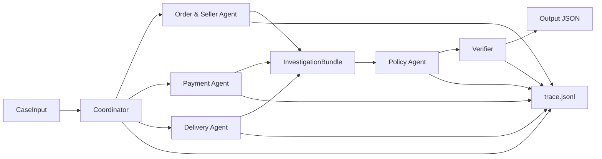

# Kế hoạch triển khai cho nhóm 5 thành viên

> Thiết kế runtime, message contract, sequence và state machine chi tiết: [multi-agent-flow.md](multi-agent-flow.md). Thiết kế log/trace, metrics và cải tiến giữa các run: [observability-and-improvement.md](observability-and-improvement.md).

## 1. Mục tiêu và phạm vi

Xây dựng hệ thống multi-agent thực sự để xử lý đủ 50 khiếu nại Olist, tạo đúng 50 file `output/EC_001.json` đến `output/EC_050.json`, kèm `architecture.md`, `trace.jsonl`, `metadata.json` và báo cáo cá nhân. Kết quả phải bám đúng thứ tự ưu tiên của `EC_POLICY_V1`, chỉ dùng evidence có thể kiểm chứng từ CSV và tuân thủ giới hạn **model của từng agent không quá 10 tỷ parameters**.

Kế hoạch ưu tiên correctness và khả năng chạy lặp lại. Việc đọc/join dữ liệu, tính tiền, so sánh timestamp và kiểm tra schema là các tool xác định bằng code mà agent được quyền gọi. Mỗi agent vẫn phải có model, system prompt, phạm vi tool và output contract riêng; các agent trao đổi fact/evidence bằng handoff có cấu trúc. Không được chỉ đặt nhiều tên agent trong khi toàn bộ xử lý nằm trong một prompt duy nhất hoặc một hàm coordinator.

### Ràng buộc multi-agent và model

- Có 6 logical agent: `Coordinator`, `OrderSeller`, `Payment`, `Delivery`, `Policy`, `Verifier`. Năm thành viên triển khai 6 agent theo ownership ở mục 5; số thành viên không bắt buộc bằng số agent.
- Mỗi logical agent là một runtime unit riêng với `agent_id`, model config, system prompt, allowlist tool, input schema và output schema riêng.
- **Tất cả** model, bao gồm model của Coordinator và Verifier, phải có parameter size `<= 10B`; không dùng model lớn hơn làm fallback, judge hoặc repair.
- Có thể dùng cùng một model <=10B cho nhiều agent, nhưng mỗi agent vẫn phải có prompt, quyền truy cập và context riêng.
- Tool Python/SQL không bị xem là model; tool chỉ truy xuất/tính toán dữ liệu và trả fact. Quyết định/handoff phải diễn ra qua agent phù hợp.
- Coordinator chỉ điều phối, không được đọc trực tiếp toàn bộ CSV hoặc tự làm thay domain agent.
- Policy Agent chỉ áp dụng policy trên bundle đã handoff; Verifier kiểm độc lập và có quyền reject/return-for-repair.
- `metadata.json` phải ghi cho từng agent: `agent_id`, `role`, `model_name`, `parameter_count`, `provider/runtime`, `prompt_version`, `tools` và decoding settings.
- Startup phải hard fail nếu thiếu parameter metadata hoặc `parameter_count > 10000000000`.
- `trace.jsonl` phải chứng minh lượt chạy thật: request/response hoặc summary có cấu trúc của từng agent, nguồn evidence, handoff sender/receiver, model name, duration và trạng thái verify/repair.

## 2. Hiện trạng repo và rủi ro phải xử lý trước

- Repo mới có dữ liệu, input và các artifact mẫu; chưa có source code hoặc test.
- `architecture.md`, `logging/trace.jsonl` và `logging/metadata.json` đang rỗng.
- README yêu cầu `trace.jsonl` và `metadata.json` ở root, trong khi skeleton hiện đặt chúng trong `logging/`. Bản nộp cuối phải có artifact ở đúng vị trí root; `logging/` chỉ nên là vùng trung gian nếu nhóm vẫn muốn giữ.
- Hiện chỉ có 49 file tên `EC_*.json`. File `EC_002.json` chứa `case_id = EC_001`, chuỗi tên file tiếp tục lệch một số, và payload `EC_050` nằm trong file không đuôi `input/download`.
- `individual_5SoCuoiMHV_HoVaTen.md` có phần câu hỏi end-to-end không liên quan bài Olist (Crossref/vector index). Mỗi thành viên cần thay bằng nội dung đúng bài multi-agent dispute resolution, không sao chép nguyên mẫu.
- `output/` chưa có kết quả. Trước khi nộp phải kiểm tra zip chỉ chứa đúng 50 JSON, không chứa `.gitkeep`, source, log hoặc secret.

### Task DP-01 — Tiền xử lý và lập chỉ mục dữ liệu

**Owner:** TV2. **Reviewer:** TV3 kiểm các trường tiền; TV4 kiểm các trường timestamp. **Thời gian:** 9:30-10:10. Task này chạy song song với scaffold/contract của TV1.

Mục tiêu của DP-01 là tạo một data layer sạch, có schema và index ổn định cho tool của các agent. Không chỉnh sửa trực tiếp CSV gốc và không suy diễn thêm dữ kiện không tồn tại.

**Input:**

- 50 payload sau khi chuẩn hóa bằng `case_id`;
- `olist_orders_dataset.csv`;
- `olist_order_items_dataset.csv`;
- `olist_order_payments_dataset.csv`;
- `olist_sellers_dataset.csv`.

Không cần tiền xử lý geolocation, customers, reviews, products hoặc category translation vì sáu rule của `EC_POLICY_V1` không sử dụng chúng.

**Các bước xử lý:**

1. Validate header/schema và các cột bắt buộc trước khi đọc dữ liệu.
2. Chuẩn hóa ID thành string; không cắt leading zero nếu có.
3. Parse các timestamp cần dùng theo một quy ước duy nhất, giữ nguyên giá trị/ngữ nghĩa timezone của CSV.
4. Parse `price`, `freight_value`, `payment_value` thành `Decimal`; không nhân payment với installments.
5. Lọc tập `claimed_order_id` của 50 case để tạo case index nhỏ, nhưng vẫn giữ liên kết tới raw source row.
6. Join/lookup order → items → sellers và order → payments; phát hiện orphan/missing/duplicate bất thường.
7. Tạo index theo `order_id`, `(order_id, order_item_id)`, `(order_id, payment_sequential)` và `seller_id`.
8. Tạo aggregate xác định: item total, freight total, payment total, payment count; không phân loại issue/refund trong preprocessing.
9. Sinh data quality manifest gồm schema version, source checksum, row count, matched case count, missing/orphan/parse errors.
10. Chạy validation và dừng nếu không đủ 50 case order IDs hoặc có lỗi parse ảnh hưởng policy.

**Output đề xuất:**

| Artifact | Nội dung |
| --- | --- |
| `data/processed/olist_case_index.sqlite` | Bảng/index read-only cho 50 order và raw rows liên quan |
| `data/processed/manifest.json` | Schema version, checksum, counts và quality issues |
| `scripts/preprocess_data.py` | Pipeline chạy lặp lại từ raw CSV; không sửa raw data |
| `tests/test_preprocess_data.py` | Schema, type, join, aggregate và idempotency tests |

`data/processed/` là generated artifact, nên có thể thêm vào `.gitignore` và tái tạo bằng một lệnh. `manifest.json` có thể được lưu làm audit artifact nếu nhóm muốn chứng minh dữ liệu đã kiểm tra.

**Definition of Done DP-01:**

- Nhận đủ 50 `case_id` và 50 order ID duy nhất theo input chính thức.
- Mọi order ID tra cứu được hoặc có lỗi dữ liệu được báo rõ; không silently drop.
- Item/payment rows giữ nguyên ID nguồn để dựng evidence.
- Tổng tiền từ processed layer khớp phép cộng Decimal trên raw rows.
- Timestamp comparator nhận kiểu nhất quán, không đổi timezone ngoài yêu cầu.
- Chạy preprocessing hai lần cho cùng checksum tạo manifest/counts giống nhau.
- TV3 ký xác nhận money fields; TV4 ký xác nhận timestamp fields.

**Cách tránh block:** TV2 công bố schema của processed tables ngay tại contract freeze 9:50. TV3, TV4 và TV5 tiếp tục phát triển bằng fixtures/raw-tool fakes; chỉ chuyển sang processed repository adapter ở Checkpoint 3. Nếu DP-01 chưa READY lúc 10:10, integration vẫn dùng raw CSV adapter, còn preprocessing được sửa song song và không chặn unit test của agent khác.

### Task LOG-01 — Trace, run history và feedback loop

**Owner:** TV1 xây trace/runtime. **Co-owner:** TV5 xây summary/compare/regression gate. Task bắt đầu từ Checkpoint 0 và chạy xuyên suốt đến khi nộp.

- Mỗi lần chạy tạo thư mục bất biến `logging/runs/<run_id>/`.
- Ghi `trace.jsonl`, `cases.jsonl`, `errors.jsonl`, `verifier_feedback.jsonl`, `metrics.json`, `summary.md` và `config_snapshot.json` riêng cho run.
- Mỗi event có run/case/correlation/event ID, agent/model/prompt/tool version, sender/receiver, attempt, evidence, duration, status và error.
- Flush trace theo từng event để vẫn debug được nếu process crash.
- Sau run, TV5 so sánh candidate với baseline theo correctness, first-pass verification, repair, error owner, latency và output diff.
- Không ghi secret/raw authorization. Dùng structured output/hash/summary sau redaction.
- Khi nộp, TV1 promote một run đạt 50/50: thay thế root `trace.jsonl` bằng trace sanitized của run đó và tạo root `metadata.json`. Không append lịch sử vào root artifact.

**Definition of Done LOG-01:** có thể chọn bất kỳ case/run để dựng lại cây Coordinator → domain agents → Policy → Verifier; lỗi được route tới đúng TV1–TV5; compare report chỉ ra regression/improvement; run thiếu config checksum hoặc agent handoff không được promote.

### Preflight bắt buộc (9:30-9:50)

1. Đọc mọi payload JSON hợp lệ trong `input/`, chuẩn hóa tên theo trường `case_id`, rồi xác nhận đủ tập duy nhất `EC_001..EC_050`.
2. Không dùng tên file nguồn làm định danh nghiệp vụ; runner ghi output bằng `case_id` đã validate.
3. Kiểm tra mọi `claimed_order_id` tồn tại trong bảng orders.
4. Chốt runtime, framework và model <=10B; tạo `.env.example`, `.gitignore`, tuyệt đối không commit secret.
5. Chốt contract ở mục 4 trước khi mỗi người bắt đầu code. Sau thời điểm này, thay đổi contract phải được Tech Lead duyệt.

## 3. Chiến lược làm song song

Năm workstream sở hữu các file khác nhau và giao tiếp qua contract cố định. Mỗi người viết unit test bằng fixture nhỏ của riêng module, không chờ pipeline thật. Coordinator dùng stub responses; Verifier dùng golden outputs; các domain agent dùng order ID mẫu. Chỉ đến pha tích hợp mới nối module thật.

Order/Seller, Payment và Delivery phải được Coordinator gọi fan-out đồng thời bằng ba agent invocation độc lập. Policy chỉ nhận fact có cấu trúc sau fan-in; Verifier là một agent invocation độc lập và là hard gate trước khi ghi file. Nếu Verifier reject, Coordinator gửi lỗi có cấu trúc về đúng agent chịu trách nhiệm, tối đa một vòng repair để tránh loop vô hạn.

## 4. Contract chung phải đóng băng sớm

Contract có thể triển khai bằng dataclass/Pydantic/JSON Schema, nhưng tên và ý nghĩa trường phải thống nhất:

| Contract | Trường tối thiểu |
| --- | --- |
| `CaseInput` | `case_id`, `opened_at`, `claimed_order_id`, `policy_version`, `message` |
| `OrderSellerFacts` | order status/timestamps, danh sách item, seller, shipping limit, item total, freight total, evidence IDs |
| `PaymentFacts` | payment rows, payment total, payment count, chênh lệch với item + freight, payment evidence IDs |
| `DeliveryFacts` | delivered-to-carrier, delivered-to-customer, estimated date, `is_late`, seller handoff violations |
| `InvestigationBundle` | `CaseInput` và ba fact object trên, warning/error có cấu trúc |
| `PolicyDecision` | primary issue, status, confidence, ranked cause, responsible party, refund, actions, policy evidence |
| `FinalOutput` | đúng toàn bộ output schema trong README |
| `TraceEvent` | `run_id`, `case_id`, `agent`, `event`, `timestamp`, `input_refs`, `output_summary`, `duration_ms`, `status`, `error` |
| `AgentConfig` | `agent_id`, `model_name`, `parameter_count`, `prompt_version`, `allowed_tools`, `input_schema`, `output_schema` |
| `HandoffEnvelope` | `run_id`, `case_id`, `sender`, `receiver`, `message_type`, `payload`, `evidence_ids`, `attempt` |

Quy ước chung:

- Tiền dùng `Decimal`, tổng xong mới làm tròn 2 chữ số; không dùng float cho quyết định policy.
- Timestamp parse cùng một quy ước và so sánh trực tiếp giá trị CSV, không tự đổi timezone.
- Danh sách được sort ổn định để output chạy lại không thay đổi.
- Mọi evidence ID được dựng từ row thật và validate format/tồn tại trước khi ghi.
- Thiếu item: `item_ids`, `seller_ids` rỗng; item/freight total bằng `0.0`.
- Mỗi domain result có `source_rows` hoặc evidence tương đương để Verifier có thể kiểm chứng độc lập.
- Agent không được tự ghi vào `output/`; chỉ runner ghi sau khi Verifier trả về `valid=true`.
- Mọi handoff phải đi qua `HandoffEnvelope`; không chia sẻ message history toàn cục giữa các agent.
- Mỗi agent chỉ thấy dữ liệu tối thiểu cần cho vai trò của mình và chỉ gọi tool trong allowlist.

## 5. Phân công 5 thành viên

Thay `TV1..TV5` bằng tên thật khi bắt đầu. Mỗi thành viên sở hữu độc quyền các file chính để giảm xung đột merge.

### TV1 — Tech Lead, Coordinator và runtime

**Ownership đề xuất:** `src/contracts.py`, `src/agents/coordinator.py`, `src/runtime.py`, `src/runner.py`, `src/tracing.py`, `src/config/agents.*`, `architecture.md`, `metadata.json`.

**Công việc:**

- Chốt cấu trúc project, contract chung, cấu hình model/framework và CLI chạy 1 case/50 case; thêm startup guard bảo đảm mọi model <=10B.
- Làm preflight input, chuẩn hóa theo `case_id`, phát hiện thiếu/trùng/sai filename.
- Xây Coordinator Agent với prompt và tool riêng; fan-out ba agent invocation, fan-in bundle, handoff sang Policy rồi Verifier.
- Tạo trace append-only riêng trong `logging/runs/<run_id>/`, quản lý correlation/error theo case; chỉ root `trace.jsonl` bị thay thế khi promote run nộp bài.
- Dùng stub để hoàn thành orchestration trước khi các agent thật sẵn sàng.
- Viết `architecture.md` đúng yêu cầu vai trò, quyền truy cập và handoff.

**Bàn giao độc lập:** chạy được `runner --case EC_001` bằng stub, trace đủ các bước, lỗi một agent không làm mất chẩn đoán.

### TV2 — Data access và Order & Seller Agent

**Ownership đề xuất:** `src/data/olist_repository.py`, `src/tools/order_tools.py`, `src/agents/order_seller.py`, prompt tương ứng, `tests/test_repository.py`, `tests/test_order_seller.py`.

**Công việc:**

- Xây OrderSeller Agent cùng system prompt/tool allowlist; lớp đọc/index các bảng cần thiết theo `order_id`, tránh load geolocation/reviews/products nếu policy không dùng.
- Trả order status và timestamp, item rows, seller IDs, `shipping_limit_date`, item/freight total.
- Dựng đúng evidence `order:`, `item:` và `seller:` từ row thật.
- Xử lý order nhiều item/payment/seller và trường hợp không có item.
- Cung cấp fixture nhỏ và adapter theo `OrderSellerFacts` đã đóng băng.

**Bàn giao độc lập:** unit test pass cho order thường, canceled/unavailable, nhiều item và không có item.

### TV3 — Payment Agent và financial reconciliation

**Ownership đề xuất:** `src/agents/payment.py`, `src/tools/payment_tools.py`, prompt tương ứng, `src/finance.py`, `tests/test_payment.py`, `tests/test_finance.py`.

**Công việc:**

- Xây Payment Agent cùng system prompt/tool allowlist; lấy tất cả payment row theo order, không nhân `payment_value` với installments.
- Tính `payment_total`, số payment row và payment IDs; đối soát với item + freight trong tolerance `0.10 BRL`.
- Cung cấp hàm Decimal/rounding dùng chung cho refund và totals.
- Test split payment hợp lệ, một payment, chênh ngoài tolerance, payment total bằng 0.

**Bàn giao độc lập:** trả `PaymentFacts` xác định, có test biên `0.09`, `0.10`, `0.11` BRL và nhiều dòng payment.

### TV4 — Delivery Agent và phân tích handoff

**Ownership đề xuất:** `src/agents/delivery.py`, `src/tools/delivery_tools.py`, prompt tương ứng, `tests/test_delivery.py`, `tests/fixtures/delivery/`.

**Công việc:**

- Xây Delivery Agent cùng system prompt/tool allowlist; so sánh delivery thực tế với estimated date để xác định giao trễ/đúng hạn.
- Khi giao trễ, đối chiếu carrier handoff với từng `shipping_limit_date` để tách lỗi seller và logistics.
- Trả danh sách seller vi phạm đã sort, delivery flags và bằng chứng nguồn; không tự quyết refund.
- Test đúng hạn, seller handoff trễ, logistics trễ, nhiều item cùng seller và timestamp thiếu.

**Bàn giao độc lập:** `DeliveryFacts` đúng contract và test đủ ba nhánh delivery chính.

### TV5 — Policy Agent, Verifier và quality gate

**Ownership đề xuất:** `src/agents/policy.py`, `src/agents/verifier.py`, hai prompt và tool allowlist độc lập, `src/schemas/output.schema.json`, `tests/test_policy.py`, `tests/test_verifier.py`, `scripts/package_output.*`.

**Công việc:**

- Xây hai agent invocation độc lập: Policy Agent mã hóa đúng thứ tự ưu tiên; Verifier Agent chỉ kiểm tra/reject và không dùng chung context ẩn với Policy.
- Map chính xác issue → cause → party → refund → action → case status.
- Verifier kiểm schema, enum, giới hạn list, confidence, totals/refund, evidence format và evidence tồn tại.
- Tạo golden cases cho đủ 6 policy branches mà không chờ agent thật.
- Viết pre-submit check và script tạo zip chỉ gồm đúng 50 output JSON.

**Bàn giao độc lập:** policy/validator pass toàn bộ golden test; một output sai evidence hoặc sai refund bị hard fail.

## 6. Lịch thực hiện trong khung competition

| Thời gian | TV1 | TV2 | TV3 | TV4 | TV5 |
| --- | --- | --- | --- | --- | --- |
| 9:30-9:50 | Preflight, scaffold, contract | Rà schema order/item | Rà schema payment | Rà timestamp/delivery | Chuyển policy thành decision table/golden cases |
| 9:50-11:10 | Coordinator, runner, trace bằng stub | Repository + Order/Seller | Payment + finance | Delivery | Policy + Verifier + schema |
| 11:10-11:40 | Tích hợp các adapter | Hỗ trợ tích hợp dữ liệu | Hỗ trợ đối soát totals | Hỗ trợ edge cases timestamp | Chạy quality gate |
| 11:40-12:10 | Chạy đủ 50, triage lỗi | Sửa lỗi data/order | Sửa lỗi payment | Sửa lỗi delivery | Sửa policy/schema, thống kê coverage |
| 12:10-12:30 | Chốt architecture/metadata/trace | Review affected entities/evidence | Review financial resolution | Review root cause/party | Pre-submit check, tạo zip |

Nếu có thêm thời gian trước 9:30, chỉ làm preflight và đóng băng contract; không để một người viết trước logic thuộc ownership của người khác.

### 6.1 Quy ước trạng thái checkpoint

Mỗi thành viên cập nhật trạng thái theo bốn giá trị:

- `TODO`: chưa bắt đầu.
- `DOING`: đang thực hiện, ghi kèm branch/commit hiện tại.
- `READY`: đã tự kiểm tra, artifact sẵn sàng để tích hợp/review.
- `BLOCKED`: không thể tiếp tục; phải ghi reproduction, owner cần hỗ trợ và thời điểm cần xử lý.

Không đánh dấu `READY` nếu mới viết code nhưng chưa chạy kiểm tra được nêu trong checkpoint. TV1 duy trì bảng trạng thái chung; mỗi thành viên chỉ cập nhật hàng của mình.

### 6.2 Checkpoint 0 — Chuẩn bị và đóng băng contract (9:30-9:50)

**Mục tiêu chung:** repo có cấu trúc tối thiểu, đủ 50 payload hợp lệ theo `case_id`, contract/schema được chốt để năm người có thể làm độc lập.

| Thành viên | Việc phải làm | File/artifact bàn giao | Tự kiểm tra trước khi READY |
| --- | --- | --- | --- |
| TV1 | Tạo scaffold; kiểm 50 input; chuẩn hóa payload `EC_050` từ `input/download`; chốt `CaseInput`, envelope, agent interface; cấu hình 6 agent và model guard <=10B | `src/contracts.py`, `src/config/agents.*`, `src/runner.py` skeleton, preflight report | Danh sách case ID đúng `EC_001..EC_050`; config model >10B bị từ chối |
| TV2 | Khởi động DP-01: validate schema, parse kiểu, lọc 50 order, tạo processed index; đồng thời chọn fixture delivered, canceled/unavailable, multi-item, no-item | `scripts/preprocess_data.py`, `data/processed/manifest.json`, `tests/fixtures/order_seller/` | Manifest thấy đủ 50 order IDs; fixture parse được; IDs tồn tại |
| TV3 | Đọc schema payments; chọn fixture single/split/zero/mismatch; xác nhận quy tắc Decimal và tolerance | `tests/fixtures/payment/`, bảng test biên | Có sample cho chênh `0.09`, `0.10`, `0.11`; không nhân installments |
| TV4 | Đọc timestamp orders và shipping limit items; chọn fixture đúng hạn/seller late/logistics late/missing timestamp | `tests/fixtures/delivery/`, bảng expected flags | Mỗi fixture có expected `late_stage`; so sánh timestamp nhất quán |
| TV5 | Chuyển README thành decision table 6 nhánh; dựng một golden input/output mỗi nhánh; chốt output JSON Schema | `tests/fixtures/policy/`, `src/schemas/output.schema.json` skeleton | Đủ 6 primary issue; mapping cause/party/refund/action/status không thiếu |

**Exit gate 9:50:**

- TV1 công bố contract version `v1`; tất cả thành viên xác nhận adapter của mình có thể trả đúng schema.
- Preflight tìm thấy đúng 50 `case_id` duy nhất.
- Sáu agent config đều có model name và parameter count <=10B.
- DP-01 đã công bố processed schema/index contract; pipeline có thể tiếp tục chạy đến 10:10 mà không block agent work.
- Nếu contract chưa chốt, TV2–TV5 vẫn triển khai tool/domain logic bằng fixture nhưng không tự tạo contract khác.

### 6.3 Checkpoint 1 — Xây module độc lập (9:50-10:30)

**Mục tiêu chung:** từng workstream chạy được bằng unit test/stub, không phụ thuộc module của thành viên khác.

| Thành viên | Việc phải làm | File/artifact bàn giao | Tự kiểm tra trước khi READY |
| --- | --- | --- | --- |
| TV1 | Xây `CoordinatorAgent` bằng stub; tạo ba task song song; validate `HandoffEnvelope`; triển khai LOG-01 run directory và event writer | `src/agents/coordinator.py`, `src/runtime.py`, `src/tracing.py`, run artifacts, coordinator tests | Stub flow sinh đủ request/response cho 6 agent; trace có sender/receiver/correlation tree và sống sót khi process fail giả lập |
| TV2 | Hoàn tất DP-01 lúc 10:10; xây repository adapter trên processed index và OrderSeller tools; trả order/items/sellers/totals/evidence | `data/processed/olist_case_index.sqlite`, manifest, `src/data/olist_repository.py`, `src/tools/order_tools.py` | DP-01 DoD pass; lookup đúng; không xử lý geolocation/reviews/products không cần thiết |
| TV3 | Xây Payment tools và Decimal finance helpers | `src/tools/payment_tools.py`, `src/finance.py` | Test sum row, split payment và tolerance pass |
| TV4 | Xây Delivery tools và timestamp comparator | `src/tools/delivery_tools.py` | Test bằng hạn, trước hạn, sau hạn và thiếu timestamp pass |
| TV5 | Xây deterministic policy evaluator/schema validator và LOG-01 summarize/compare skeleton | policy/verification tools, JSON Schema, `scripts/summarize_run.py`, `scripts/compare_runs.py` | Sáu golden decisions pass; schema reject enum/list sai; sample run tạo metrics/summary |

**Exit gate 10:30:** mỗi người demo một lệnh test trong phạm vi mình; chưa cần gọi model/provider thật. Riêng TV2 phải demo chạy lại DP-01 và truy vấn ít nhất một order có nhiều item/payment từ processed index.

### 6.4 Checkpoint 2 — Hoàn thiện agent và structured handoff (10:30-11:10)

**Mục tiêu chung:** mỗi logical agent có prompt/config/tool allowlist và trả output đúng contract qua invocation riêng.

| Thành viên | Việc phải làm | File/artifact bàn giao | Tự kiểm tra trước khi READY |
| --- | --- | --- | --- |
| TV1 | Nối Coordinator với agent runtime; timeout/retry một lần; fan-in thành immutable bundle; thêm input/output schema validation | Coordinator/runtime hoàn chỉnh, integration test bằng fake agents | Một domain agent timeout chỉ retry đúng agent đó; coordinator không chứa domain logic |
| TV2 | Xây prompt + `OrderSellerAgent`; giới hạn tool; map tool result thành `OrderSellerFacts` | `src/agents/order_seller.py`, prompt/config, tests | Agent không gọi payment tool; output pass schema với multi-item/no-item |
| TV3 | Xây prompt + `PaymentAgent`; map rows thành `PaymentFacts`; tạo payment evidence | `src/agents/payment.py`, prompt/config, tests | Payment IDs đúng sequential; output dùng Decimal-derived totals |
| TV4 | Xây prompt + `DeliveryAgent`; trả seller violations đã sort và `late_stage` | `src/agents/delivery.py`, prompt/config, tests | Agent phân biệt seller/logistics/not_late; không tự quyết refund |
| TV5 | Xây `PolicyAgent` và `VerifierAgent` thành hai invocation/context độc lập; trả decision/verify schemas | `src/agents/policy.py`, `src/agents/verifier.py`, prompts/config, tests | Trace/test chứng minh hai invocation; Verifier reject sai priority/evidence/refund |

**Exit gate 11:10:** TV2–TV5 cung cấp một sample response thật theo contract. TV1 chạy flow bằng adapters hoặc giữ stub riêng cho module chưa READY; không block toàn nhóm.

### 6.5 Checkpoint 3 — Tích hợp end-to-end (11:10-11:40)

**Mục tiêu chung:** chạy end-to-end ít nhất 6 case đại diện, một case cho mỗi primary issue.

| Thành viên | Việc phải làm trong tích hợp | Review chéo | Điều kiện hoàn tất |
| --- | --- | --- | --- |
| TV1 | Thay stub bằng agent thật; quản lý run/correlation ID; atomic writer; tổng hợp lỗi | Review boundary của Coordinator với TV5 | 6 representative cases đi hết flow hoặc có lỗi được route đúng |
| TV2 | Theo dõi affected entities, evidence order/item/seller và missing-item behavior | Review output TV4 về shipping limit | Entity/evidence của 6 case khớp CSV |
| TV3 | Theo dõi totals và refund source; xử lý sai khác contract giữa order totals/payment | Review financial output TV5 | Tất cả tiền recompute khớp Decimal và rule |
| TV4 | Theo dõi delivery flags, violating seller và responsible party đầu vào | Review timestamps với TV2 | Ba nhánh delivery representative đúng root cause |
| TV5 | Theo dõi policy priority, draft assembly, verifier và targeted repair | Review trace/repair với TV1 | 6 issue branches đúng mapping; lỗi giả lập bị reject |

**Test bắt buộc tại checkpoint:**

1. Một case thành công có đủ 6 agent invocation.
2. Một case cố tình sai payment bị Verifier route về PaymentAgent.
3. Một case cố tình sai policy được route về PolicyAgent.
4. Sau repair, Policy và Verifier chạy lại; không chạy lại domain agent không liên quan.

**Exit gate 11:40:** 6/6 representative cases verified và written; không còn schema incompatibility.

### 6.6 Checkpoint 4 — Full run 50 case và triage (11:40-12:10)

**Mục tiêu chung:** đạt `50 received = 50 verified = 50 written`, không có output giả hoặc case im lặng bị bỏ qua.

| Thành viên | Dashboard/nhóm lỗi sở hữu | Việc phải làm | Điều kiện hoàn tất |
| --- | --- | --- | --- |
| TV1 | Runtime, timeout, trace, missing/duplicate output | Chạy batch; lưu run history; route lỗi; bảo đảm mọi case có event terminal | 50 case đều có terminal state và correlation tree |
| TV2 | `ORDER_*`, `ITEM_*`, `SELLER_*`, entity/evidence mismatch | Sửa repository/OrderSeller; kiểm các order đặc biệt | Không còn lỗi entity/order/seller |
| TV3 | `PAYMENT_*`, `FINANCIAL_*`, tolerance/rounding | Recompute các case lỗi; sửa payment/finance | Không còn mismatch payment/refund |
| TV4 | `DELIVERY_*`, `TIMESTAMP_*`, handoff classification | Sửa comparator/Delivery output | Không còn case delivery undetermined trong tập chính thức |
| TV5 | `POLICY_*`, `SCHEMA_*`, `EVIDENCE_*`, verifier reject | Sửa policy/assembler/verifier; tạo summary và compare baseline/candidate; chạy validator | 50 output pass gate; compare report không có regression chưa giải thích |

**Triage SLA:** owner có 10 phút để tái hiện và sửa. Nếu lỗi nằm ở contract, TV1 và owner liên quan tạo một contract patch nhỏ; các thành viên khác tiếp tục review output, không dừng toàn nhóm.

**Exit gate 12:10:** full run mới nhất có 50 verified outputs, 0 failed; chạy lặp lại không đổi nội dung output.

### 6.7 Checkpoint 5 — Đóng gói và nộp bài (12:10-12:30)

**Mục tiêu chung:** artifact đúng README, không secret, zip chỉ chứa 50 JSON.

| Thành viên | Việc phải làm | Artifact ký xác nhận |
| --- | --- | --- |
| TV1 | Chốt architecture; promote run tốt nhất thành root `trace.jsonl`/`metadata.json`; xác nhận 6 model <=10B và trace A2A thật | Architecture/model/trace checklist + promoted run ID |
| TV2 | Audit affected entities và order/item/seller evidence trên sample + edge cases | Entity/evidence audit note |
| TV3 | Audit item/freight/payment/refund trên tất cả 50 case bằng recompute script | Financial audit summary |
| TV4 | Audit late/not-late và seller/logistics party trên mọi delivery case | Delivery classification summary |
| TV5 | Chạy final validator; xác nhận compare report; tạo zip; kiểm nội dung zip | Validator report, run comparison và submission zip manifest |

**Final go/no-go checklist:**

- [ ] Đủ đúng 50 output từ `EC_001.json` đến `EC_050.json`.
- [ ] `case_id` bên trong khớp filename.
- [ ] 50/50 pass Verifier và final validator.
- [ ] `trace.jsonl` là run mới nhất, có đủ 6 agent invocation/case thành công.
- [ ] `logging/runs/<run_id>/` giữ lịch sử; promoted run ID khớp root trace/metadata.
- [ ] Candidate không regression so với baseline hoặc mọi diff đã được giải thích/ký xác nhận.
- [ ] `metadata.json` khai báo cả 6 agent; mọi model/fallback <=10B.
- [ ] `architecture.md` mô tả role, access và handoff.
- [ ] Năm báo cáo cá nhân phản ánh đúng ownership/artifact.
- [ ] Không commit `.env`, API key, token hoặc secret.
- [ ] Zip không có thư mục lồng, `.gitkeep`, log, source hoặc file lạ.

Chỉ TV1 tuyên bố `GO` sau khi TV2–TV5 đã ký xác nhận phần audit tương ứng. Nếu bất kỳ hard gate nào fail, trạng thái là `NO-GO`, sửa đúng owner rồi chạy lại validator; không sửa tay trực tiếp JSON trong zip.

### 6.8 Checklist theo từng thành viên

Phần này giúp mỗi người theo dõi xuyên suốt mà không phải đọc lại toàn bộ bảng.

#### TV1 — Coordinator/runtime

- [ ] CP0: preflight 50 case, scaffold, contract v1, model guard.
- [ ] CP1: stub multi-agent flow và trace envelope.
- [ ] CP2: agent runtime, fan-out/fan-in, timeout/retry.
- [ ] CP3: nối adapters, targeted repair, atomic writer.
- [ ] CP4: chạy 50 case, route lỗi và chốt run thành công.
- [ ] CP5: architecture, metadata, trace và quyết định GO/NO-GO.

#### TV2 — Data/OrderSeller

- [ ] CP0: khởi động DP-01, công bố processed schema + fixtures order/item/seller.
- [ ] 10:10: DP-01 READY, manifest đủ 50 case, money/timestamp review hoàn tất.
- [ ] CP1: processed repository adapter và deterministic tools.
- [ ] CP2: OrderSellerAgent + prompt + structured output.
- [ ] CP3: audit affected entities/evidence cho 6 representative cases.
- [ ] CP4: xử lý toàn bộ lỗi order/item/seller.
- [ ] CP5: ký entity/evidence audit.

#### TV3 — Payment/finance

- [ ] CP0: payment fixtures + Decimal/tolerance cases.
- [ ] CP1: payment tools + finance helpers.
- [ ] CP2: PaymentAgent + prompt + structured output.
- [ ] CP3: audit totals/refund cho 6 representative cases.
- [ ] CP4: xử lý toàn bộ lỗi payment/financial.
- [ ] CP5: ký financial audit 50 case.

#### TV4 — Delivery

- [ ] CP0: timestamp fixtures cho bốn nhánh.
- [ ] CP1: delivery tools + comparator.
- [ ] CP2: DeliveryAgent + prompt + structured output.
- [ ] CP3: audit delivery/root cause cho representative cases.
- [ ] CP4: xử lý toàn bộ lỗi delivery/timestamp.
- [ ] CP5: ký delivery classification audit.

#### TV5 — Policy/Verifier/QA

- [ ] CP0: decision table + 6 golden cases + schema skeleton.
- [ ] CP1: policy/verification deterministic tools.
- [ ] CP2: hai agent invocation độc lập + prompts.
- [ ] CP3: verify 6 branches và hai repair scenarios.
- [ ] CP4: final validator cho 50 output.
- [ ] CP5: tạo/kiểm zip và ký validator report.

## 7. Git workflow và nguyên tắc tránh block

- Nhánh đề xuất: `codex/tv1-orchestration`, `codex/tv2-order-data`, `codex/tv3-payment`, `codex/tv4-delivery`, `codex/tv5-policy-qa` (đổi prefix theo quy ước nhóm nếu cần).
- Không cùng sửa một file. Muốn thay contract phải mở commit riêng, thông báo nhóm và cập nhật adapter/test liên quan.
- Merge theo artifact nhỏ: contract/scaffold → từng agent + unit test → integration. Không chờ một PR lớn cuối buổi.
- Mỗi module phải có fake/stub ở test; không chờ repository hay model provider để chạy unit test.
- Mỗi commit phải pass test trong phạm vi module. Trước merge integration, chạy toàn bộ test.
- `architecture.md` do TV1 tổng hợp; người khác gửi đoạn nội dung qua file `docs/notes/tvN-*.md` nếu cần, tránh cùng sửa trực tiếp.
- Mỗi thành viên tạo báo cáo riêng `individual_<5SoCuoiMHV>_<HoVaTen>.md`; không cùng sửa file mẫu.

### Thứ tự merge giảm xung đột

1. TV1 merge scaffold + contracts + stub interfaces.
2. TV2, TV3, TV4 merge song song vì sở hữu file riêng.
3. TV5 merge policy/verifier; golden tests không phụ thuộc dữ liệu thật.
4. TV1 chỉ thay stub bằng adapters; không copy logic domain vào coordinator.
5. Cả nhóm review kết quả 50 case theo checklist ownership.

## 8. Kế hoạch test và kiểm chứng

### Unit/golden tests

- Sáu nhánh policy đều có ít nhất một golden case.
- Test thứ tự ưu tiên khi một order thỏa nhiều điều kiện.
- Test order không item, nhiều item, nhiều seller và nhiều payment.
- Test tolerance payment và Decimal rounding.
- Test timestamp bằng hạn, trước hạn, sau hạn và thiếu timestamp.
- Test mọi evidence pattern và kiểm tồn tại row nguồn.

### Integration tests

- Một case đại diện cho mỗi primary issue chạy end-to-end.
- Assert mỗi case có invocation của Coordinator, ba domain agent, Policy và Verifier; không chấp nhận trace chỉ có một model call.
- Assert `sender`, `receiver` và schema của mọi handoff; thử chặn một agent gọi tool ngoài allowlist.
- Test startup hard fail với model `>10B`, thiếu parameter count và cấu hình fallback lớn hơn 10B.
- Chạy cùng input hai lần phải cho output byte-equivalent, ngoại trừ trace timestamp/run ID.
- Lỗi một case được trace rõ; runner không ghi output chưa qua verifier.
- Sau full run: 50 case input duy nhất, 50 output duy nhất, 50 case ID khớp, không có file lạ.

### Pre-submit hard gate

- Đủ `EC_001.json..EC_050.json`, JSON parse được và `case_id` khớp filename.
- Mọi enum, list limit, confidence và schema đúng README.
- `item_total_brl + freight_total_brl` được đối chiếu với payment theo rule phù hợp.
- Refund đúng rule: full payment, full freight hoặc 0.
- Evidence không quá 10, đúng format và tồn tại trong CSV/policy set.
- `trace.jsonl` là run mới nhất; `metadata.json` ghi model, parameter size, framework, runtime.
- Mỗi logical agent có model <=10B được khai báo; không có model/judge/fallback ẩn vượt giới hạn.
- Trace chứng minh A2A handoff thật, tối thiểu 6 agent invocations cho mỗi case thành công.
- `architecture.md` hoàn chỉnh; 5 báo cáo cá nhân đã thay nội dung mẫu không liên quan.
- Zip chỉ có 50 JSON trực tiếp ở root của zip; không có thư mục lồng, `.gitkeep`, log, source hoặc `.env`.

## 9. Điểm đồng bộ tối thiểu

Chỉ cần ba sync ngắn, phần còn lại làm song song:

1. **9:50 — Contract freeze (10 phút):** xác nhận field, enum, Decimal/timestamp và error model.
2. **11:10 — Integration readiness (10 phút):** từng người demo test và một sample response; chưa pass thì coordinator vẫn dùng stub.
3. **12:10 — Submission gate (10 phút):** review metrics, artifact và quyết định go/no-go cho zip.

Blocker được ghi theo mẫu: `owner`, `symptom`, `reproduction`, `expected contract`, `needed-by`. Sau 10 phút chưa tự xử lý được thì báo TV1; không tự sửa file thuộc ownership của người khác.

## 10. Definition of Done chung

Một workstream chỉ được coi là xong khi có agent config/prompt/tool allowlist, code, test, sample output theo contract, hướng dẫn chạy ngắn và không chứa secret. Toàn dự án chỉ hoàn tất khi full run tạo 50 output hợp lệ, Verifier pass 100%, startup chứng minh mọi model <=10B, trace thể hiện invocation và A2A handoff thật của 6 logical agent, artifact nằm đúng vị trí và zip đã được kiểm bằng một lệnh tự động.
